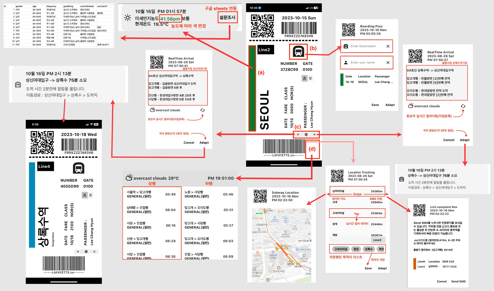

 트립투서울(subway_project)
-------------

### 주요기능
 1. 예상시간계산, 하차전 알림,이동경로에 데이터 제공
 2. 유저위치에 가까운 지하철역 리스팅
 3. sms 민원신고기능
 4. 미세먼지데이터, 날씨데이터 제공 
 5. 실시간 열차 데이터 제공 
 6. 열차 시간표 데이터 제공

 

### 파일구조

* **custom_widget**
  + 공통적으로 사용되는 위젯으로 구성  
  
+ **data_provider**
+ 상태관리와 비지니스 로직을 모두 포함 
  + filted_provider
    + 결과값 검색 후 필터링되는 비즈니스 logic 의주  
  + store_provider
    + 필터링된 데이터값을 저장하는 비즈니스 logic (A는 목적지, B는 출발지점이나 실질적으론 구분을 두지않음)
  + subordinate_provider
    + 필트드 프로바이더에서 추출된 데이터를 파라미터로 받아 로직을 완성해 다른 출력값을 산출하는 프로바이더  
* **model**
  + 데이터 타입의 모델도 있으나 데이터 분류를 의해 의도적으로 만든 model도 존재함(riverpod은 하나의 타입만 존재하기때문에 추가된 작업포함)  

- **presentation** 
  + frame_object
    - design_object 
      - 기능이 없는 위젯 
    - display_object 
      - 상태관리의 결과값을 UI로 보여주는 리엑티브 위젯 
    - input_object   
      - 검색값을 넣는 위젯
      
  - insidedialog_object
    - design_object  
      - 기능이 없는 위젯 
    - display_object 
      - 상태관리의 결과값을 UI로 보여주는 리엑티브 위젯 
    - input_object   
      - 검색값을 넣는 위젯 
  - insidetoggle_object
    - toggle switch 내부에서 콜백되는 다이얼로그 의주로 구성 

  - **screen**
    - intro_screen
      - 가장 처음 로딩했을 때 소개하는 페이지  
    - line_picker_screen
      - main_screen 에서 역 이름을 지정한 이후에 호선 정보를 검색, 저장하는 페이지 
    - loading_screen
      - 앱 시작후 1초간 로딩되는 페이지 이전에는 파이어스토어를 연동해 불규칙한 정보 ex) 파업일정, 전장연 시위 등을 알려주는 용도로 사용되었으나 현재 단순 UI만 보여줌  
    - main_screen
      - 전반적인 화면구성을 보여줌  
    - map_screen
      - dialog 패이지내에서 종속적으로 활용되었으나 용도의 확장을 고려중 
    - table_screen
      - 지하철 코드를 파라미터로 받아 출발지점의 시간표를 보여주는 구간  
    
  
  - **repository**
    - 내부에 저장된 데이터, chopper, geolocator 

* **setting**
  * key값, export, firebase_options, notification setting ..... 

### 주로 사용된 패키지

>**riverpod_flutter**, **freezed,chopper**, **local_notification**,
**cloud_firestore**, **get_storage**, **geolocator**, **http**, **hive**

